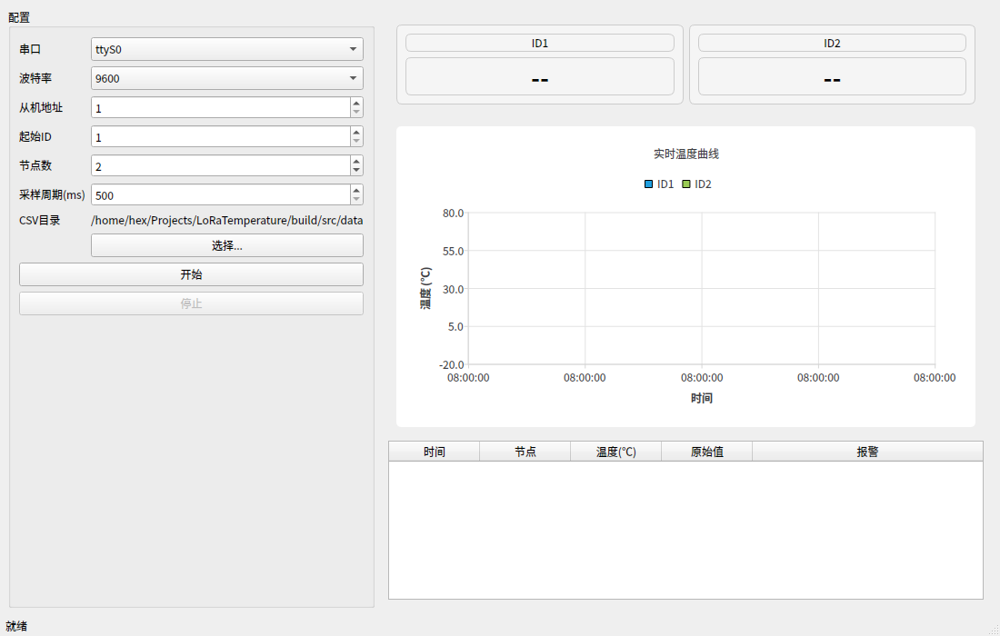

# LoRa 温度监测系统

跨平台 Qt6 桌面应用，通过串口 Modbus RTU 协议与 LoRa 集中器通信，实时采集多点无线温度传感器和无线压力传感器数据，提供卡片、曲线、表格三种可视化视图，自动记录到 CSV 文件，并支持温度上下限报警。



## 功能特性

### 数据采集
- **Modbus RTU 协议**：功能码 0x04，读输入寄存器
- **温度采集**：支持 1~16 个无线温度传感器，2 秒轮询（可调）
- **压力采集**：支持无线压力传感器（YYW-VS），32 位无符号整数，单位 Pa
- **压力节点同时读取温度**：压力传感器内部温度探头数据一并保留
- **多线程采集**：ModbusWorker 运行在子线程，UI 不卡顿

### 数据展示
- **数据卡片**：8 个卡片网格布局，温度节点显示 `xx.x ℃`，压力节点显示 `xx.xxx kPa + xx.x ℃`
- **实时曲线**：Qt Charts 绘制，最近 5 分钟数据，每格 30 秒，最多 8 条唯一颜色曲线
- **ID 选择器**：8 个复选框 + 颜色色块，与曲线颜色一致，勾选立即显示/隐藏
- **数据表格**：6 列（时间/节点/温度/压力/原始值/报警），最近 500 条，最新置顶
- **日志框**：底部全宽，显示操作/报警/Modbus 帧日志，等宽字体，最多 500 行

### 报警功能
- **全局温度阈值**：所有节点共用一组上下限（默认 -10℃ ~ 60℃）
- **实时生效**：修改 SpinBox 立即生效，无需重启采集
- **视觉报警**：卡片超上限变红、超下限变蓝
- **日志报警**：报警事件写入日志框

### 数据记录
- **CSV 自动保存**：`temp_YYYYMMDD_HHMMSS.csv`，UTF-8 BOM（Excel 友好）
- **目录可配置**：默认 `<appdir>/data`，可自定义并持久化
- **完整字段**：时间/节点ID/温度/压力/原始值/在线状态/报警状态

### 配置管理
- **配置持久化**：QSettings 保存所有参数，下次启动自动恢复
- **串口热插拔**：提供"刷新"按钮，打开软件后插入 USB 串口可重新扫描
- **运行时调整**：采样周期、报警阈值、压力 ID 等实时生效

### Modbus 帧调试
- **请求帧日志**：压力读取请求帧打印到日志框（HEX 格式）
- **应答帧日志**：压力读取应答帧打印到日志框（含 CRC，HEX 格式）
- **便于排错**：可直接对照协议文档分析通讯问题

## 技术栈

- **语言**：C++17
- **框架**：Qt 6（Core / Gui / Widgets / SerialPort / SerialBus / Charts）
- **构建**：CMake（`qt_standard_project_setup`，自动 MOC）
- **测试**：QTest 单元测试（3 个测试套件）
- **平台**：Linux + Windows

## 项目结构

```
LoRaTemperature/
├── CMakeLists.txt              # 根 CMake
├── README.md                   # 本文件
├── docs/
│   └── 功能设计.md             # 详细功能设计文档
├── src/
│   ├── CMakeLists.txt          # 应用目标
│   ├── main.cpp                # 程序入口
│   ├── Sample.h                # 采集数据结构 + 解析函数
│   ├── AppConfig.h/.cpp        # 配置持久化（QSettings）
│   ├── CsvWriter.h/.cpp        # CSV 追加写入
│   ├── ModbusWorker.h/.cpp     # 子线程 Modbus 轮询
│   ├── ChartManager.h/.cpp     # QtCharts 曲线管理
│   └── MainWindow.h/.cpp       # 主窗口 UI + 信号槽组装
├── tests/
│   ├── CMakeLists.txt
│   ├── tst_sample.cpp          # 温度/压力解析单元测试
│   ├── tst_appconfig.cpp       # 配置读写测试
│   └── tst_csvwriter.cpp       # CSV 写入测试
├── data/                       # 运行时 CSV 输出目录（自动创建）
└── lora温度集中器教程/         # 硬件协议文档与厂家软件
```

## 编译

### 依赖

- Qt 6.2+（含 Charts、SerialPort、SerialBus 模块）
- CMake 3.16+
- C++17 编译器

### Linux 编译

```bash
# 指定 Qt6 安装路径（如非系统默认位置）
export CMAKE_PREFIX_PATH=/home/hex/Qt/6.10.1/gcc_64

cmake -B build -S .
cmake --build build -j$(nproc)
```

### Windows 编译

```cmd
set CMAKE_PREFIX_PATH=C:\Qt\6.10.1\msvc2019_64
cmake -B build -S .
cmake --build build --config Release
```

### 运行测试

```bash
ctest --test-dir build --output-on-failure
```

预期输出：3 个测试套件（tst_sample / tst_appconfig / tst_csvwriter）全部 PASS。

## 运行

```bash
./build/src/LoRaTemperature
```

## 使用说明

### 1. 硬件连接

- USB 转 RS485 → LoRa 集中器
- 集中器已注册温度传感器（ID1~5）和压力传感器（ID6）

### 2. 软件配置

| 配置项 | 推荐值 | 说明 |
|--------|--------|------|
| 串口 | 自动检测 | 选择 USB 转 RS485 对应串口 |
| 波特率 | 9600 | 集中器默认 |
| 从机地址 | 1 | 集中器 Modbus 地址 |
| 起始 ID | 1 | 第一个传感器 ID |
| 节点数 | 6 | 覆盖 ID1~6 |
| 采样周期 | 2000 ms | 可运行时调整 |
| 压力传感器 ID | 6 | 逗号分隔，支持多个 |
| 报警下限 | -10 ℃ | 全局生效 |
| 报警上限 | 60 ℃ | 全局生效 |

### 3. 开始采集

点击"开始"按钮：
- 自动创建 CSV 文件
- 日志框显示采集参数和压力传感器 ID
- 卡片、曲线、表格开始实时更新

### 4. 观察数据

- **左侧卡片**：ID1~5 显示温度，ID6 显示压力(kPa) + 温度(℃)
- **右上曲线**：温度变化趋势，通过 ID 选择器控制显示
- **右下表格**：历史记录，最新置顶
- **底部日志**：操作日志、报警日志、Modbus 帧（压力读取）

### 5. 停止采集

点击"停止"按钮，CSV 文件关闭，可用 Excel 打开查看。

## Modbus 协议参数

### 串口格式

| 参数 | 值 |
|------|-----|
| 波特率 | 9600 bps |
| 数据位 | 8 |
| 停止位 | 1 |
| 校验位 | 无 |
| 从机地址 | 1（集中器） |

### 寄存器映射

#### 温度寄存器（所有节点）

| 参数 | 值 |
|------|-----|
| 功能码 | 0x04（读输入寄存器） |
| 起始地址 | 0x76C1（30337） |
| 每节点寄存器数 | 1 |
| 节点 N 地址 | `0x76C1 + (N-1)` |
| 数据格式 | 16 位有符号整数（补码，大端）÷ 10 |

解析示例：
- `0x00BF` (191) → 19.1 ℃
- `0xFF60` (-160) → -16.0 ℃
- `0x0000` (0) → 0.0 ℃

#### 压力寄存器（仅压力节点）

| 参数 | 值 |
|------|-----|
| 功能码 | 0x04（读输入寄存器） |
| 起始地址 | 0x8EF9（36601） |
| 每节点寄存器数 | 2 |
| 节点 N 地址 | `0x8EF9 + 2×(N-1)` |
| 数据格式 | 32 位无符号整数（2 个 16 位寄存器组合），单位 Pa |

解析示例：
- `0x000F 0x4240` → 1000000 Pa
- ID6 压力地址 = `0x8F03`（36611）

### 通信示例

**读 ID6 压力请求帧**：
```
01 04 8F 03 00 02 AB 1F
```

**集中器应答帧（1000000 Pa）**：
```
01 04 04 00 0F 42 40 FA D7
```

## CSV 文件格式

文件名：`temp_YYYYMMDD_HHMMSS.csv`  
编码：UTF-8 with BOM

| 列 | 说明 | 示例 |
|----|------|------|
| timestamp | 采集时间 | 2026-07-27 14:30:01.123 |
| node_id | 节点 ID | 6 |
| temp_celsius | 温度（℃），所有节点都有 | 24.1 |
| pressure_pa | 压力（Pa），仅压力节点，温度节点为空 | 1000000 |
| raw | 寄存器原始值（HEX 大写） | 0X00BF |
| online | 在线状态 | 1 |
| alarm | 报警状态 | 0=正常 / 1=超上限 / -1=超下限 |

## 配置持久化

配置存储位置：
- **Linux**：`~/.config/LoRaTemperature/LoRaTemperature.conf`
- **Windows**：注册表 `HKEY_CURRENT_USER\Software\LoRaTemperature\LoRaTemperature`

可配置项：串口名、波特率、数据位、停止位、校验位、从机地址、起始节点 ID、节点数、采样周期、温度寄存器地址、压力寄存器地址、压力传感器 ID 列表、CSV 目录、报警上下限。

CSV 目录迁移保护：若保存的目录与当前程序不在同一目录树（如旧 build 目录），自动回退到默认 `data` 相对路径。

## 架构说明

采用信号槽解耦的模块化设计：

```
ModbusWorker (子线程)
    │ dataReady(QVector<Sample>)
    │ frameLog / error / statusMessage
    ▼
MainWindow (主线程)
    ├── CsvWriter      → 写 CSV 文件
    ├── ChartManager   → 更新曲线
    ├── 卡片标签        → 更新当前值
    ├── 表格           → 插入历史记录
    └── 日志框         → 打印日志
```

- `ModbusWorker` 运行在子线程，通过 `QThread + moveToThread` 实现，避免阻塞 UI
- 跨线程信号槽自动使用 `Qt::QueuedConnection`，已注册 `QVector<Sample>` 和 `AppConfig` 的 metatype
- 各模块职责单一，便于独立测试和维护

详细设计见 [docs/功能设计.md](docs/功能设计.md)。

## 报警功能

全局共享上下限阈值（默认下限 -10 ℃，上限 60 ℃）：
- 超过上限：卡片变红
- 低于下限：卡片变蓝
- 正常：卡片灰色

阈值实时生效，无需重启采集；持久化到配置文件，下次启动自动恢复。

## 软件图标

程序启动时用 QPainter 动态绘制温度计图标作为窗口 logo，包含红色球部、白色玻璃管描边、红色水银柱和顶部刻度线。

## 许可证

本项目为私有项目，保留所有权利。
